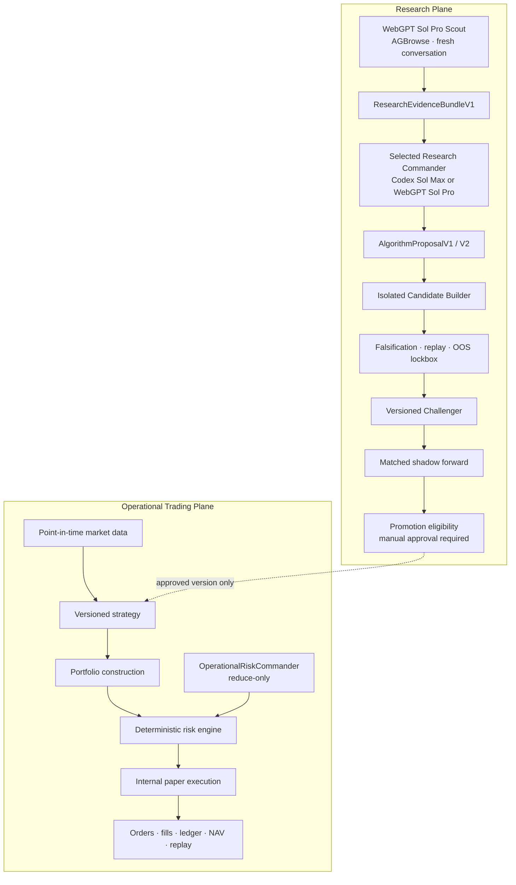

# Adaptive LLM Quant

Adaptive LLM Quant is an auditable research and paper-trading system for
developing versioned quantitative strategies with AI-assisted market research.
Its north star is durable, risk-adjusted alpha after realistic costs—not a
particular ticker, sector, or trading style.

> **Current status**
>
> - This is a research and paper-trading system. It does not guarantee profit.
> - Real broker routing is unavailable and `real_order_routing=false` is enforced.
> - AI cannot edit, replace, promote, or trade through the current Champion.
> - Recursive improvement remains disabled for automatic operation:
>   `recursive_improvement.enabled=false`. Phase 0 through PR 4 provide the
>   outcome ledger, immutable memory, deterministic Meta Controller, V2
>   Commander contracts, whole-portfolio delta-Sharpe/OOS V2, matched shadow
>   V2, Promotion V2, and a protected chronological meta-OOS evaluator.
> - Every public account, position, balance, order, and result is synthetic.
> - WebGPT/AGBrowse and Codex execution require separate user-managed local
>   environments; browser state, credentials, and private datasets are not bundled.
> - The first live-built `Q1-DET 2.0.0` Challenger remains `PROPOSED`.
>   Its prospective target-state observations and subsequently matured
>   next-close outcomes are forward research evidence, not an independent
>   shadow portfolio, falsification pass, OOS pass, or promotion evidence.
>   A versioned evaluation service is now present, but it remains dormant
>   until the first 126 successful forward sessions are immutable. It then
>   assembles the predeclared stateful variants, runs isolated primary/replay
>   Candidate lanes, records mandatory falsification once, and stops. It does
>   not request OOS, start shadow, promote, or route an order.
> - A separate operator-controlled bridge can verify and commit a locked,
>   whole-portfolio OOS V2 request, explicitly activate the resulting matched
>   Champion/Challenger pair, and append hash-bound paper cycles. Every mutation
>   defaults to dry-run. The bridge remains dormant until the forward cohort and
>   mandatory gates pass; it cannot auto-promote or route a broker order.
> - A sealed V2 Candidate can enter the typed outcome ledger as a `DISCOVERY`
>   action plus technical test result. This is chronological audit lineage
>   only: it is never meta-training evidence and cannot advance falsification,
>   OOS, shadow, promotion, or order routing.

The system searches for robust improvements by trying to falsify each hypothesis
before accepting it. “Stable alpha” therefore means a candidate edge that remains
economically meaningful after point-in-time validation, costs, execution delays,
capacity limits, regime splits, out-of-sample evaluation, and independent shadow
forward observation. It is a research objective, not a claim about current or
future returns.

Prospective Candidate results are admitted only from a predeclared forward
timeline. A decision is bound to completed PIT inputs, the Candidate target is
sealed independently, and its return is later measured from the next session's
adjusted close through the following session's adjusted close. The outcome
source cutoff is fixed in advance, so a revision first observed after that
cutoff cannot rewrite the result. At least 126 common forward sessions and 504
instrument observations are required merely to make the later falsification
input eligible for assembly. The resulting V2 dataset binds every scenario to
its own request, calendar path, transformation, forward-outcome source, and
availability cutoff; future records cannot alter the frozen first-N cohort.

The engineering record for the first tool-backed cycle is
[First Live Research Cycle — 2026-07-29 KST](docs/research/first-live-cycle-2026-07-29.md).

## System overview



The planes have different authority and schedules:

- The **Operational Trading Plane** runs deterministic paper portfolios,
  risk controls, conservative fills, append-only accounting, and replay.
  `OperationalRiskCommander` is a fast, reduce-only operational safeguard. It
  cannot research or rewrite strategies.
- The **Research Plane** gathers active web evidence, diagnoses strategy
  failures, proposes new hypotheses, builds candidates in isolation, and
  registers immutable Challengers. It cannot access credentials, route orders,
  mutate ledgers, inspect raw locked OOS observations, or change the Champion.

## Adaptive research loop

```text
Research
→ Algorithm Proposal
→ Isolated Implementation
→ Automated Falsification
→ Versioned Challenger
→ Locked OOS Evaluation
→ Matched Shadow Forward
→ Promotion Eligibility or Rejection
```

The selected Research Commander is exactly one of:

- `CODEX_SOL_MAX`: `gpt-5.6-sol`, reasoning profile `max`, executed from the
  separate Research Commander repository in a fresh process and work directory.
- `WEBGPT_SOL_PRO`: GPT-5.6 Sol Pro, reasoning profile `xhigh`, executed through
  headed Chrome, CDP, and AGBrowse in a fresh ChatGPT conversation.

Both receive the same version-matched, hashed request contract. Historical
cycles retain `ResearchRequestV1`/`ResearchDecisionV1`. Recursive cycles use
`ResearchRequestV2`/`ResearchDecisionV2`, embedding one immutable verified
memory snapshot and one deterministic action plan. Commander selection is
append-only. Changing the selection makes outstanding requests stale. Each
request binds the exact selection ID and version, so switching away and later
back to the same model does not revive an older request.

The Scout, Commander, and Builder are separate invocations. The Builder
receives only an approved structured proposal, a sanitized request binding,
constraints, and a clean source snapshot—not the full Research Memory,
Commander conversation, or hidden reasoning.

## Universe: catalog-driven US equities and ETFs

Research is not limited to SOXL, SOXS, semiconductor products, or the Q1
demonstration universe. A versioned `AvailableDataCatalogV1` defines eligible
`US_EQUITY` and `US_ETF` instruments, their point-in-time history, and shadow
execution support for each research cycle.

There is no hardcoded research-symbol allowlist. A proposal may use only
instruments present in its bound catalog and must declare the target universe,
required data, liquidity assumptions, capacity, turnover, and expected failure
modes. Leveraged and inverse products require an explicit proposal and are never
activated implicitly.

Existing `paper_forward_v2` and `q1_math_core_v1` runs remain readable as
versioned operational baselines. Their fixed universes do not constrain future
Challenger research.

## Champion and Challenger safety

- The Champion is immutable in place.
- Every change creates a new semantic strategy version.
- Historical V1 Candidate artifacts retain their original patch contract.
  New recursive V2 Candidates are limited to dedicated `challengers/`
  strategy, feature, calibration, experiment, strategy-config, candidate-test,
  and Challenger-document namespaces, and every V2 change must add a new file
  rather than modify, delete, rename, or copy an existing file.
- Risk, execution, ledger, broker, persistence schema, migrations, credentials,
  and the release-security workflow are outside Builder authority.
- Mandatory falsification failure prevents OOS or shadow admission.
- The OOS service returns only `PASS`/`FAIL`, bounded aggregates, and reason codes.
- Each Challenger receives an independent shadow arm with matched market,
  schedule, execution, cost, liquidity, and starting-capital contracts.
- Automatic Champion promotion is unavailable. Trusted persisted evidence may
  produce `PROMOTION_ELIGIBLE`; explicit human approval and a second,
  expected-version-fenced human Champion designation are both required.
- Failed and retired candidates remain in the append-only audit record.

The operational AI/guard experiment uses four independent arms:
`B0-VOL`, `B3-GUARD`, `B3-AI`, and `B3-AI-GUARD`. This separates the deterministic
guard main effect, AI main effect, and their interaction. Combined results must
not be labeled “AI alpha” without matched factorial attribution.

## Web research

The Web Scout actively investigates official disclosures, primary datasets,
regulators, exchanges, reputable news, industry sources, and—when useful—social
discussion. X and Reddit may identify narratives, rumors, sentiment, and leads,
but an uncorroborated social claim remains `UNVERIFIED`.

The only supported WebGPT path is:

```text
headed Chrome → local CDP → AGBrowse → ChatGPT web UI
              → GPT-5.6 Sol Pro / xhigh
```

There is no API or model fallback. Model, reasoning profile, conversation,
request, browser session, completion state, and response binding are verified
around every invocation. See
[WebGPT active research](docs/webgpt-agbrowse-research.md).

## Local development

Requirements:

- Python 3.12 or newer
- [`uv`](https://docs.astral.sh/uv/)
- SQLite for isolated tests; PostgreSQL for the operational persistence contract
- A separate local AGBrowse/Chrome environment for live Web Scout runs
- A local checkout of the Research Commander repository for Codex
  Commander/Builder runs

From the repository root:

```powershell
uv sync
uv run python -m trading.cli config validate --all
uv run python -m trading.cli db upgrade
uv run python -m trading.cli seed demo
uv run python -m trading.cli replay --run-id demo_run
uv run python -m trading.cli verify --run-id demo_run
uv run pytest
uv run ruff check .
uv run pyright
```

Research contract and status commands:

```powershell
uv run python -m trading.cli research schema
uv run python -m trading.cli research status
uv run python -m trading.cli research select --commander CODEX_SOL_MAX
uv run python -m trading.cli research meta-policy build --help
uv run python -m trading.cli research oos-v2 --help
uv run python -m trading.cli research shadow-runtime status
uv run python -m trading.cli research shadow-runtime prospective-cycle --help
```

The UI can be started on a loopback address:

```powershell
uv run python -m trading.cli ui serve --host 127.0.0.1 --port 8765
```

Use `--status-only` on a different loopback port when an existing
version-pinned process already owns market data and paper runtime. The
status-only surface starts no workers and rejects all non-read HTTP methods.

The Research tab displays Commander selection, Scout state, evidence,
proposals, Challenger status, OOS results, trusted versus unattested shadow
cycles, source-provenance readiness, promotion eligibility, and publication
links. A local external model environment must pass its own fail-closed
preflight before live research is accepted.

## Data, credentials, and public examples

Copy `.env.example` to a local ignored `.env` only when a local provider requires
credentials. Never place secrets in commands, fixtures, logs, prompts,
screenshots, issue text, or commits.

The public repository excludes:

- credentials, cookies, browser profiles, CDP tokens, and account identifiers;
- real balances, positions, quantities, orders, and derived account values;
- local absolute paths and user names;
- raw licensed news/browser payloads;
- `.env`, `.local`, local databases, and private OOS observations.

`config/paper-account.example.yaml` is synthetic. Raw evidence objects remain in
gitignored local storage; committed evidence contains provenance, a bounded
lawful excerpt, hashes, timestamps, tier, and license notes.

The repository also preserves one
[actual synthetic Challenger cycle](examples/challengers/alpha-1.1.4/README.md):
the Builder's generated patch passed 19 candidate/ABI tests and deterministic
replay, then failed the mandatory single-symbol-or-month dependence test. OOS
and shadow admission were therefore blocked. The example is a rejection record,
not a performance claim.

Run the release scanner before any public push:

```powershell
uv run python scripts/public_release_scan.py `
  --root . `
  --expected-repository story7077/adaptive-llm-quant-public
```

Any release-scan failure blocks publication.

## Documentation

- [Architecture](docs/architecture.md)
- [Research Plane](docs/research-plane.md)
- [WebGPT and AGBrowse research](docs/webgpt-agbrowse-research.md)
- [Codex context isolation](docs/codex-context-isolation.md)
- [Algorithm proposal contract](docs/algorithm-proposal-contract.md)
- [Champion and Challenger lifecycle](docs/champion-challenger.md)
- [OOS lockbox](docs/oos-lockbox.md)
- [Public release security](docs/public-release-security.md)
- [Threat model](docs/threat-model.md)
- [Operations](docs/operations.md)
- [Legacy forward paper operations](docs/forward-paper-operations.md)
- [Q1 mathematical core](docs/q1-math-core.md)
- [Recursive improvement status and contracts](docs/research/recursive-improvement.md)
- [Experiment outcome ledger](docs/research/experiment-outcome-ledger.md)
- [Deterministic Meta Controller and research memory](docs/research/meta-controller.md)
- [Portfolio-level delta-Sharpe V2](docs/research/portfolio-delta-sharpe.md)
- [Chronological meta-OOS V1](docs/research/chronological-meta-oos.md)
- [Matched Research shadow runtime](docs/research/shadow-paper-runtime.md)

## License and responsibility

No license is implied unless a license file states otherwise. This software is
for research and paper evaluation. Users are responsible for data licenses,
provider terms, local model access, and compliance applicable to their
environment. Nothing in this repository is investment advice.
