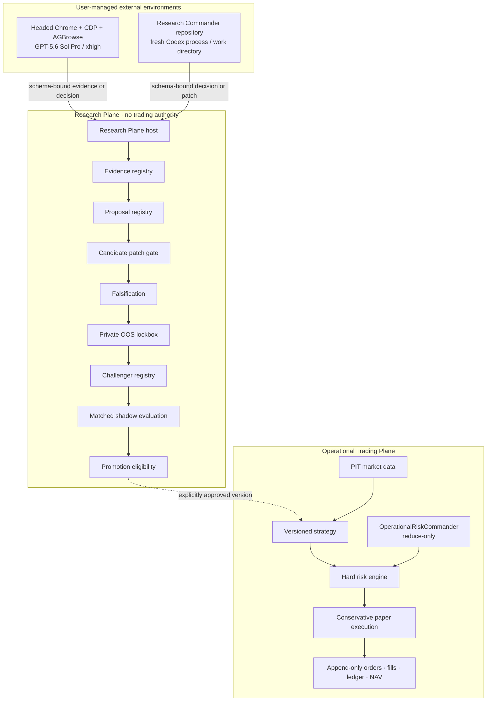

# Architecture

## Design objective

Adaptive LLM Quant separates live research from deterministic paper operation.
The objective is to discover durable, risk-adjusted alpha across a versioned
catalog of US-listed equities and ETFs while making every hypothesis, input,
implementation, rejection, and promotion decision reproducible.

No component promises profitability. The system treats a profitable backtest as
a claim to attack, not as sufficient evidence.

## Trust boundaries

The Research Plane has no broker credentials, order endpoint, production unlock,
ledger mutation capability, or raw locked-OOS access. The Operational Plane does
not modify algorithms during a session.

## Operational Trading Plane

The operational path preserves these contracts:

- point-in-time data with `available_at <= decision_time`;
- versioned algorithms and configuration manifests;
- independent arm cash, positions, orders, fills, ledger, and NAV;
- append-only state transitions and immutable economic records;
- deterministic replay and stable idempotency keys;
- lease ownership and database-clock fencing;
- conservative paper fills, cost models, and reconciliation;
- deterministic hard risk controls;
- `real_order_routing=false`.

`OperationalRiskCommander` is the renamed operational AI controller. It may
reduce risk within a narrow policy schema. It cannot add exposure, create a
strategy, edit code, select order quantities, or promote a Challenger.

The legacy `paper_forward_v2` and `q1_math_core_v1` algorithms remain versioned,
readable baselines. Their existing universes and semantics are not retrofitted.

## Research Plane

The Research Plane is a slower, asynchronous loop:

1. Aggregate strategy performance, failure clusters, regimes, execution costs,
   capacity, and recent point-in-time evidence.
2. Run a fresh Web Scout conversation to build
   `ResearchEvidenceBundleV1`.
3. Bind a `ResearchRequestV1` to exactly one append-only Commander selection.
4. Accept `ResearchDecisionV1` only when all request bindings and hashes match.
5. For a proposal, run a separate fresh Candidate Builder invocation.
6. Inspect the patch against allowed and forbidden paths.
7. register a new immutable `ChallengerManifestV1`.
8. Run mandatory falsification and deterministic replay.
9. Submit only passing candidates to the OOS lockbox.
10. Assign only OOS-passing candidates to an independent matched shadow arm.
11. Compute promotion eligibility without changing the Champion.

Operational schedules continue while the Research Plane is unavailable or
blocked.

## Role separation

| Role | May do | Must not do |
| --- | --- | --- |
| `WEB_SCOUT` | Browse, capture provenance, corroborate claims, structure evidence | Propose orders, reuse a conversation, assert social claims as verified facts |
| `RESEARCH_COMMANDER` | Diagnose failures and return a structured research decision or proposal | Edit code, inspect locked OOS detail, approve its own implementation |
| `CANDIDATE_BUILDER` | Implement the approved proposal in an isolated worktree | Read Commander conversation, touch protected paths, mutate Champion |
| Falsification service | Run predeclared leakage, placebo, stress, factor, and stability tests | Relax mandatory tests for a candidate |
| OOS lockbox | Evaluate private OOS observations and return bounded results | Expose dates, trades, returns, positions, orders, or fills |
| Promotion gate | Determine eligibility from predeclared criteria | Automatically promote |

## Data and time contracts

Every research cycle has explicit `as_of`, `data_available_cutoff`, and
`expires_at` times. Market and evidence records must have been available by the
relevant cutoff. The request also binds:

- source snapshot commit;
- Champion version;
- experiment family;
- selected Commander plus exact append-only selection ID and version;
- available-data catalog;
- current evidence bundle;
- allowed and forbidden change scopes;
- experiment budget;
- canonical context manifest hash.

Late records cannot alter an already-bound historical request. New evidence
requires a new request and cycle.

## Catalog-driven universe

The research universe is a versioned `AvailableDataCatalogV1`, not a fixed list
of tickers. Each entry identifies:

- symbol and `US_EQUITY` or `US_ETF`;
- first and last availability;
- daily and intraday history coverage;
- point-in-time membership availability;
- shadow execution support;
- research tags.

A proposal fails closed if a target symbol is absent, mandatory history is
missing, a US equity lacks point-in-time membership data, or shadow execution is
unsupported. Leveraged and inverse products require an explicit proposal.

## Persistence and auditability

Commander selections, research cycles, evidence sources, proposals, Challenger
manifests, status transitions, experiment-budget usage, OOS results, and
promotion decisions are append-only. Hashes bind canonical JSON artifacts and
detect accidental or malicious substitution.

Failed candidates are records, not garbage. They remain available for duplicate
hypothesis detection, experiment-budget accounting, and postmortem analysis.

## AI and guard attribution

The operational AI and deterministic loss guard are evaluated in a matched
factorial design:

| Arm | Deterministic guard | Operational AI |
| --- | --- | --- |
| `B0-VOL` | No | No |
| `B3-GUARD` | Yes | No |
| `B3-AI` | No | Yes |
| `B3-AI-GUARD` | Yes | Yes |

The same market input, decision schedule, execution scenario, cost model,
starting capital, and liquidity policy are required. The report separates guard
main effect, AI main effect, and interaction. A combined comparison is not
isolated AI alpha.

## Security invariants

- Real broker routing is not implemented by the Research Plane.
- Automatic Champion promotion is unavailable.
- Candidate code cannot modify risk, execution, ledger, broker, migrations,
  protected persistence files, or release-security controls.
- Credentials, account identifiers, browser profiles, private OOS data, and raw
  licensed source payloads are never placed in research requests or public Git.
- Any model, reasoning, session, request, hash, freshness, or completion mismatch
  is fail-closed.

See [Threat model](threat-model.md) and
[Public release security](public-release-security.md).
