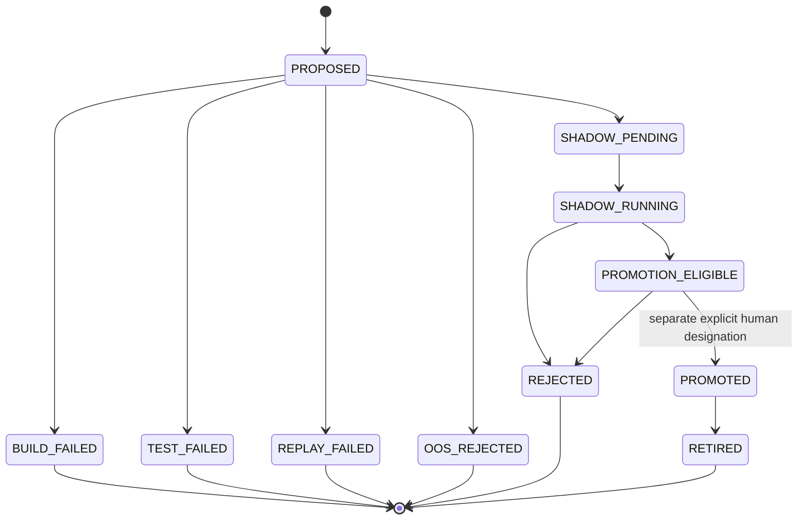

# Champion and Challenger

## Definitions

- **Champion**: the immutable strategy version currently designated as the
  operational reference.
- **Challenger**: a new version implementing one explicit, hash-bound research
  hypothesis.
- **Candidate build**: the isolated patch and test output before registration.
- **Shadow arm**: independent paper state used to evaluate a registered,
  gate-approved Challenger under matched conditions.

The Champion is never modified in place. A candidate that needs different code,
configuration, data, or parameters creates a new version.

## Lifecycle



Each transition is append-only. Terminal failures remain visible and count
against the experiment family's adaptive-research budget.

## Manifest

`ChallengerManifestV1` binds:

- Challenger, strategy, hypothesis, experiment family, and parent identities;
- source commit and patch, proposal, code, configuration, and test hashes;
- Commander and Builder identities;
- evidence sources and required data;
- decision horizon and execution universe;
- expected turnover and capacity;
- initial status and creation time.

The manifest is immutable. Status is derived from later events rather than
updating the manifest row.

## Build and patch gate

The Candidate Builder operates on a clean source snapshot. It may change only
the versioned allowlist:

```text
src/trading/features/**
src/trading/strategies/**
src/trading/calibration/**
src/trading/research/**
src/trading/experiments/**
config/strategies/**
config/research/**
tests/unit/**
tests/property/**
tests/research/**
docs/research/**
```

It may not change risk, execution, ledger, broker, security, migrations,
credentials, protected persistence files, release-security controls, or any
Champion-owned path. The gate validates normalized paths and patch bytes before
registration.

## Falsification before advancement

The Challenger must first survive every mandatory leakage, placebo, stability,
cost, delay, spread, capacity, factor, regime, data-removal, and experiment-budget
test. A missing test is not a pass. A mandatory `BLOCKED` is not a pass.

Deterministic replay must bind the exact source, code, config, and input
manifests. A replay mismatch produces `REPLAY_FAILED`.

Only a Challenger with all mandatory tests and replay passing may consume OOS
budget. Only an OOS `PASS` may become `SHADOW_PENDING`.

## Matched shadow contract

Champion and Challenger have separate:

- cash and receivables;
- positions;
- orders and fills;
- ledger and NAV;
- policy state;
- forecasts;
- strategy identity and version.

They share the exact same:

- market-input manifest;
- decision schedule;
- execution scenario;
- cost model;
- starting capital;
- liquidity policy.

The system rejects a comparison if the arm IDs are the same, strategy versions
are the same, or execution contracts differ.

See [Generic matched Research shadow runtime](research/shadow-paper-runtime.md)
for the durable paper-state, fill-cost, idempotency, and replay contract.

## Performance interpretation

Shadow reports use matched daily differences and show costs, turnover,
drawdowns, tails, capacity, error rates, and regime dependence. A favorable
headline return is insufficient.

Promotion criteria include:

- minimum independent trades and forward period;
- positive net excess return after costs;
- matched-baseline improvement and minimum economic effect;
- maximum-drawdown and tail-risk limits;
- turnover and capacity limits;
- regime robustness;
- acceptable error rate;
- reproducible replay;
- all mandatory tests passing.

Meeting every criterion creates `ELIGIBLE_REQUIRES_MANUAL_APPROVAL`.
`automatic_promotion_enabled=true` is rejected by the domain contract.

## Trusted production promotion path

Production eligibility is derived only from `TrustedPromotionEvaluationV1`.
The older caller-supplied boolean promotion helper is retained for legacy test
readability and is not exposed through the CLI or UI.

The trusted path is:

1. Materialize `TrustedShadowPerformanceSummaryV1` from the registered matched
   Champion/Challenger pair.
2. Bind the summary to the exact append-only
   `MATCHED_PAPER_CYCLE_COMMITTED` events through `run_id`,
   `shadow_pair_id`, ordered daily evidence hashes, and a materialized evidence
   hash.
3. Build host-owned `PromotionEvidenceV1` from the persisted summary, actual
   passed mandatory-falsification report, passed locked OOS result, matching
   deterministic replay artifact, candidate artifact, and current Champion
   version.
4. Evaluate every configured threshold and persist the evidence, evaluation,
   and resulting eligibility decision atomically.
5. Record a separate explicit human approval. Approval leaves the Challenger
   in `PROMOTION_ELIGIBLE`; it does not change the Champion.
6. Run a separate explicit human Champion designation with the expected current
   version. The designation row and `PROMOTED` lifecycle event commit in one
   transaction.

Champion designation uses optimistic fencing. A stale
`expected_current_version` is rejected, and concurrent requests cannot create
two current designations. Previous designation rows are never updated or
deleted. Designation changes the research reference only; it cannot route a
broker order.

Migration `0011_trusted_promotion_designation` introduces the append-only shadow
summary, promotion evidence, trusted evaluation, and Champion designation
tables. Migration `0013_candidate_artifact_registry` adds the immutable
ResearchRequest/Proposal/Manifest-bound Candidate build handoff. It is the
repository migration head.

## Example Challenger

The repository includes an
[actual synthetic end-to-end example](../examples/challengers/alpha-1.1.4/README.md):

```text
Strategy: alpha
Parent: 1.0.0
Challenger: 1.1.4
Hypothesis: five-session cross-sectional reversal
Universe: EXPA and EXPB (synthetic)
Candidate/ABI tests: 19 passed
Deterministic replay: passed
Status: TEST_FAILED
Reason: SINGLE_SYMBOL_OR_MONTH_DEPENDENCE_DETECTED
Failed gate: single_symbol_or_month_dependence
OOS allowed: false
Shadow allowed: false
```

The example preserves the structured proposal, generated source/test patch,
Candidate artifact and test hashes, strict replay result, and falsification
failure. It was not modified after the host-owned concentration failure, did
not consume OOS budget, did not enter shadow, and did not alter the Champion.
Its two-symbol universe is synthetic test input, not a system-wide restriction.
Real proposals use the request's versioned available-data catalog.

## Promotion and rollback

Promotion is an explicit, audited action outside Candidate Builder authority.
Promotion creates a new designation; it does not delete the previous Champion.
The previous version, its manifests, and all comparison data remain reproducible.

The paper-only CLI sequence is:

```powershell
uv run python -m trading.cli research shadow-summary-record `
  --summary .local/research/promotion/shadow-summary.json

uv run python -m trading.cli research promotion-evaluate `
  --challenger-id challenger-id

uv run python -m trading.cli research promotion-approve `
  --challenger-id challenger-id `
  --approved-by human-reviewer

uv run python -m trading.cli research champion-designate `
  --challenger-id challenger-id `
  --expected-current-version 1.0.0 `
  --designated-by human-reviewer `
  --idempotency-key designate-challenger-id-v1
```

The Research status and UI show the immutable shadow summary, trusted evidence,
trusted evaluation, manual approval, designation history, current Champion,
`automatic_promotion_enabled=false`, and `real_order_routing=false`.

If a promoted strategy later fails an operational condition, deterministic risk
controls may reduce paper exposure. Research may propose retirement or a new
version, but neither AI nor an operational risk policy rewrites the strategy.
