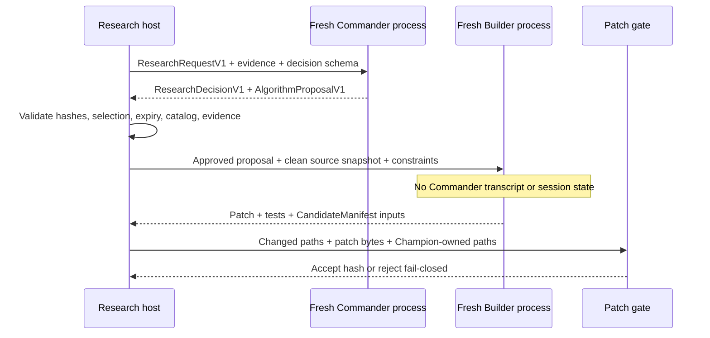

# Codex context isolation

## Scope

Codex Research Commander and Candidate Builder executions belong in the separate
`adaptive-llm-quant-research-commander` repository. They must not start inside
the trading repository, and they must never resume an earlier Codex session.

The isolation goal is stronger than prompt separation: each invocation receives
only a single immutable request bundle and a clean source snapshot inside a
fresh working directory.

## Process boundary

Every invocation requires:

- model `gpt-5.6-sol`;
- reasoning profile `max`;
- non-interactive execution;
- a fresh process;
- a fresh run directory and worktree;
- session resume disabled;
- persistent chat history disabled;
- global user memory unavailable to the process;
- no read access to sibling or prior run directories;
- network and filesystem access limited to the task contract where the local
  platform supports it.

If the required model, reasoning profile, isolation mode, or output binding
cannot be proven, the result is discarded.

## Run directory

Each cycle uses a unique directory:

```text
runs/<research-cycle-id>/
├── request/
│   ├── research_request.json
│   ├── evidence_manifest.json
│   ├── output.schema.json
│   └── constraints.json
├── input/
│   └── clean_source_snapshot/
├── work/
│   └── candidate_worktree/
├── output/
│   ├── research_decision.json
│   ├── algorithm_proposal.json
│   ├── candidate_manifest.json
│   ├── patch.diff
│   └── validation_request.json
└── logs/
    └── sanitized-run.log
```

The process receives the current cycle directory as its effective root. A path
allowlist or OS/container jail must deny sibling `runs/*`, private repositories,
home-directory state, browser profiles, credentials, and operational local data.

The public runner may record hashes and sanitized status, but not prompts or
outputs containing credentials, private account values, hidden reasoning, or
raw licensed content.

## Allowed context

The process may read only:

- the current `ResearchRequestV1`;
- the current evidence manifest and bounded evidence bundle;
- the clean public source snapshot;
- the current output schema and constraints;
- the public `AGENTS.md`;
- current Champion and active Challenger manifests included in the request;
- bounded current performance, failure-cluster, regime, cost, and capacity
  summaries;
- the current available-data catalog;
- the current proposal, for a Builder invocation.

It may not read:

- previous Codex sessions or transcripts;
- user chat history;
- the private upstream repository;
- another run's request, worktree, output, or logs;
- free-form conversation from a Commander;
- private account snapshots or provider credentials;
- `.env` or other operational secrets;
- raw locked OOS observations;
- another model's hidden reasoning;
- an unselected Commander's result.

## Request binding

Every request binds:

| Field | Purpose |
| --- | --- |
| `request_id` | Single request identity |
| `research_cycle_id` | Isolation-directory and audit identity |
| `context_manifest_hash` | Canonical hash of the entire bounded context |
| `source_snapshot_commit` | Exact clean source input |
| `champion_version` | Parent strategy authority |
| `experiment_family` | Budget and adaptive-overfit boundary |
| `selected_commander` | Sole accepted decision provider |
| `commander_selection_id` | Exact append-only selection record |
| `commander_selection_version` | Monotonic selection version; prevents switch-back replay |
| `schema_version` | Parser and validation contract |
| `expires_at` | Maximum response lifetime |

The output must echo all applicable bindings exactly. A mismatch, expiry, stale
selection, source-snapshot change, or schema mismatch invalidates the output.

## Commander and Builder separation



When Codex is Commander, Commander and Builder still use two different fresh
invocations. When WebGPT is Commander, only its accepted structured proposal is
passed to Codex Builder.

## Patch authority

Default allowed prefixes:

```text
src/trading/features/
src/trading/strategies/
src/trading/calibration/
src/trading/research/
src/trading/experiments/
config/strategies/
config/research/
tests/unit/
tests/property/
tests/research/
docs/research/
```

Protected areas include risk, execution, ledger, security, broker, migrations,
credentials, protected persistence files, and the public-release workflow.
Absolute paths, parent traversal, empty patches, non-allowlisted paths, and
Champion-owned paths are rejected before registration.

An infrastructure change cannot be smuggled into a research candidate. It must
be proposed as a separate human-reviewed development change.

## Cleanliness and reproducibility checks

Before accepting a Builder result, the host verifies:

1. The source snapshot commit equals the request binding.
2. The worktree began clean and contains no nested repository or inherited Git
   history.
3. Changed paths match the patch manifest.
4. Patch bytes match `patch_hash`.
5. No protected or Champion-owned path changed.
6. The output schema and request bindings match.
7. The test manifest identifies the exact code/config inputs.
8. Repeating the same build request produces the same immutable identities or an
   explicit deterministic conflict.

Isolation prevents context contamination; it does not make model output trusted.
All output remains untrusted input until schema, patch, test, replay, OOS, and
shadow gates pass.

## Failure and recovery

- Do not resume a failed process.
- Preserve its sanitized failure record and immutable request hash.
- Create a fresh attempt directory and fresh process for an authorized retry.
- A proposal change creates a new proposal hash and usually a new hypothesis
  version.
- Never copy a prior output into a new run to bypass a timeout or budget.
- If the jail cannot be established, stop before invoking Codex.

The operational paper system is independent and continues during all Research
Commander failures.
