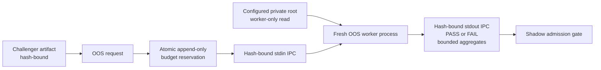

# OOS lockbox

## Objective

The out-of-sample lockbox limits adaptive overfitting. Research Commander and
Candidate Builder processes may know the evaluation contract, but they cannot
inspect the locked observations used to make the final OOS decision.

The lockbox is not an ordinary backtest report. It is a narrow service boundary.
The production path is `OosLockboxService.production(...)`; injected in-process
evaluators remain available only for deterministic unit and lifecycle tests.



## Request

An `OosEvaluationRequest` contains:

- `challenger_id`;
- `experiment_family`;
- monotonic `submission_number`;
- candidate artifact hash;
- evaluation-contract hash.

The request contains no path to locked data. A production request also binds:

- reservation ID and reservation hash;
- dataset ID and dataset-manifest hash, never a filesystem path;
- point-in-time data cutoff;
- evaluation time and expiry;
- minimum common sessions and economic-effect threshold;
- annualization convention;
- versioned Newey-West lag;
- deterministic stationary-bootstrap seed, block length, and sample count;
- base cost and the fixed 0/5/10 bp sensitivity contract.

The host writes one size-bounded JSON request to a fresh worker's stdin. The
worker reads the private-root location from its sanitized process environment.
Its stdout is parsed strictly as `OosWorkerResponseV1`; stderr is discarded and
never copied into logs. Request, reservation, artifact, evaluation-contract, and
response hashes are checked before the result is accepted.

## Private observations

The private deployment dataset is a JSON object with schema
`oos_private_dataset_v1`. Its immutable root binds the exact Candidate artifact,
evaluation contract, source-data manifest, trusted deterministic replay, and
`trusted_candidate_evaluation_v1` producer version. Each row has a private
session key, `available_at`, matched candidate and baseline returns, and matched
candidate and baseline turnover. The worker rejects:

- a missing or unreadable dataset;
- a dataset or manifest hash mismatch;
- an artifact, evaluation-contract, source-manifest, replay, or producer binding
  that is missing, malformed, or belongs to another Candidate;
- missing or non-finite values;
- negative turnover;
- duplicate session keys;
- any row with `available_at` later than the bound cutoff.

No partially validated subset is evaluated. The Commander, Candidate Builder,
main research process, database, and public artifacts never receive these rows,
their session keys, their dates, or the private-root path.

The public `OosLockboxResultV1` may return only:

- `PASS` or `FAIL`;
- predeclared reason codes;
- a bounded set of aggregate statistics;
- number of common sessions;
- OOS budget consumed;
- submission number and experiment family;
- evaluation time and canonical result hash.

The result model rejects detail keys such as:

```text
dates
trades
daily_returns
positions
orders
fills
```

The complete allowed aggregate set is:

- mean daily matched difference after the configured base cost;
- annualized matched difference using the bound annualization count;
- Newey-West standard error of the mean daily difference;
- deterministic stationary-block bootstrap 2.5% and 97.5% confidence bounds
  for the mean daily difference;
- annualized matched differences at 0, 5, and 10 bp turnover costs.

Newey-West uses Bartlett weights through the request's versioned lag. The
stationary bootstrap restarts a block with probability `1 / block_length` and
uses the bound deterministic seed. These values are diagnostics, not an
automatic statistical-significance claim.

Logs, UI payloads, research bundles, and public artifacts must follow the same
restriction.

## Default decision contract

The production contract requires at least 126 common sessions and applies the
predeclared minimum mean daily matched difference to the base-cost-adjusted
matched series. Configuration is hash-bound; changing a threshold, cost,
Newey-West lag, bootstrap setting, cutoff, artifact, or dataset creates a
different request and cannot reinterpret a previous submission.

Typical reason codes include:

- `INSUFFICIENT_COMMON_SESSIONS`
- `MINIMUM_ECONOMIC_EFFECT_NOT_MET`
- `COST_ADJUSTED_EFFECT_NOT_MET`
- `PREDECLARED_OOS_CRITERIA_PASSED`
- bounded `LOCKBOX_DATA_*` integrity reason codes

`PASS` means the candidate met this versioned OOS gate. It does not establish
profitability, statistical certainty, or promotion eligibility.

## Experiment budget

Each experiment family maintains append-only totals for:

- submissions;
- OOS budget consumed;
- hypothesis versions;
- failures.

The default configuration caps submissions, OOS uses, and hypotheses per family.
Production reservation appends both a typed `oos_budget_reservations` record and
its `OOS_CONSUMED` experiment-budget event in the same database transaction.
The reservation binds Challenger, artifact, evaluation contract, family,
submission ordinal, OOS-budget ordinal, idempotency key, and expiry.

PostgreSQL serializes a family with a transaction-scoped advisory lock. SQLite
and PostgreSQL both enforce unique family ordinals, so a concurrent losing
transaction cannot overrun the cap. Retrying the same idempotency key returns
the original immutable reservation; a changed binding is a conflict.

The table is introduced by migration `0010_oos_production_lockbox`. SQLite and
PostgreSQL both install UPDATE and DELETE guards for the reservation table.

If OOS feedback leads to a parameter, feature, universe, or rule change, the
result is a new hypothesis version and a new submission. It cannot reuse the
previous result.

## Information policy

Commander and Builder may receive:

- the evaluation contract hash;
- thresholds declared before submission;
- `PASS`/`FAIL`;
- bounded aggregate statistics;
- standardized reason codes;
- remaining budget totals, when policy permits.

They may not receive:

- private session dates or keys;
- per-trade or per-day outcomes;
- positions, orders, or fills;
- the best/worst periods;
- data slices selected in response to candidate behavior;
- an interactive query interface over locked observations.

This prevents a model from reverse-engineering the test period through repeated
targeted questions.

## Admission rules

A Challenger may reach the lockbox only after:

1. proposal and source-catalog validation;
2. patch allowlist and Champion-mutation checks;
3. code/config/test manifest creation;
4. all mandatory falsification tests passing;
5. deterministic replay succeeding;
6. experiment budget remaining.

An OOS `FAIL` becomes `OOS_REJECTED` and cannot enter shadow. An OOS `PASS` may
become `SHADOW_PENDING`, but still must satisfy minimum shadow duration, trades,
costs, risk, capacity, robustness, and replay criteria before promotion
eligibility.

## Replay and audit

The result hash binds the Challenger, experiment family, submission number,
verdict, reason codes, bounded aggregates, common-session count, budget use, and
evaluation time. The worker response additionally binds the immutable request
and reservation hashes. Worker replay of the same dataset and request produces
the same decision, statistics, result hash, and response hash. Persistence is
append-only and idempotent by Challenger and submission number.

An attempt to submit the same identity with a different result hash is a
conflict, not a replacement.

## Failure and recovery

- If locked data is unavailable or invalid, return a bounded failure reason; do
  not expose partial observations.
- If budget reservation fails, do not evaluate.
- If the worker times out, exits non-zero, emits oversized or invalid JSON, or
  returns mismatched bindings, fail closed with a sanitized host error. Do not
  include worker stderr or its private path.
- If the result cannot be persisted atomically, retry with the same immutable
  request identity.
- If a result-hash conflict occurs, stop and investigate.
- Never copy locked data into a candidate worktree for debugging.
- A code fix after an OOS failure is a new hypothesis/submission, not a replay of
  the old request.
