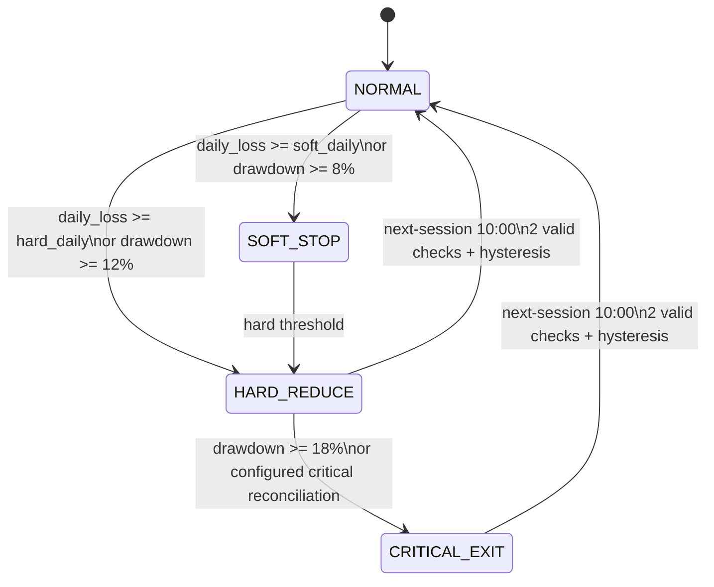
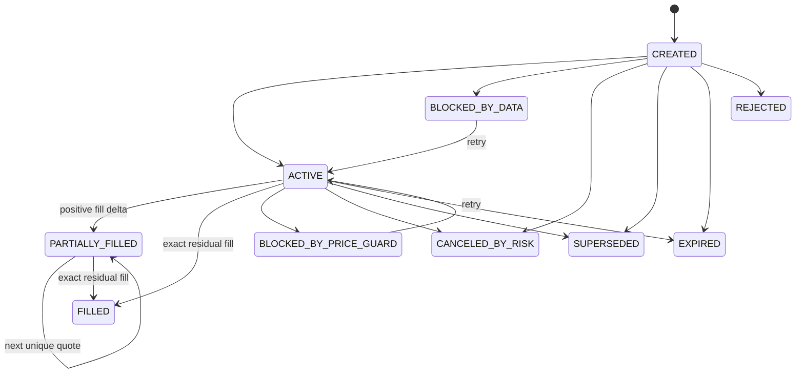

# q1_math_core_v1 운영·수학 계약

## 목적과 안전 경계

`q1_math_core_v1`은 기존 forward 알고리즘을 수정한 버전이 아니라 별도
알고리즘 경로다. 새 run은 run 생성 시 알고리즘 버전을 명시해야 하며,
기존 `paper_forward_v2` run과 그 append-only 기록의 의미는 바뀌지 않는다.
두 경로의 결정·주문·체결·평가 결과를 서로 이어 붙이거나 같은 성과 계열로
간주하지 않는다.

이 경로는 paper trading 전용이다. 내부 matched-arm 체결이 권위이며,
선택적으로 하나의 Alpaca Paper 계좌를 canary 관측 lane으로 붙일 수 있다.

- `real_order_routing=false`가 설정 파서와 런타임 경계에서 강제된다.
- Alpaca live endpoint와 토스증권으로 주문을 보내는 adapter는 없다.
- `ALPACA_PAPER_CANARY`는 정확한 Paper endpoint만 사용하고 기본 비활성이다.
- SOXS, 공매도, 마진, 레버리지 신규진입, 옵션, 개별주 alpha는 없다.
- QQQ·SOXX·USD_CASH 이외 종목은 전략 arm에 들어갈 수 없다.
- LLM은 주문·수량·종목을 선택하지 못하고 위험을 줄이는 정책만 제안한다.
- 결과는 수익성이나 통계적 유의성을 자동 주장하지 않는다.

주요 구현 경계는 다음처럼 분리돼 있다.

| 책임 | 모듈 |
|---|---|
| PIT 완료 일봉 선택 | `trading.data.q1_pit` |
| EWMA 공분산 | `trading.quant.covariance` |
| 추세·상대강도 신호 | `trading.quant.signals` |
| 제약 allocation·turnover | `trading.quant.allocator` |
| 결정론적 손실 상태·typed episode | `trading.risk.state_machine` |
| append-only 주문 상태 | `trading.execution.order_state` |
| quote 체결 경제성·가격가드 | `trading.execution.q1_paper` |
| Alpaca Paper canary transport | `trading.execution.alpaca_paper` |
| 현금결제 | `trading.settlement.service` |
| LLM reduce-only overlay | `trading.llm.q1_overlay` |
| 성과·matched attribution | `trading.evaluation.matched` |
| 버전화된 세션 일정 | `trading.runtime.q1_scheduler` |
| 불변 repository | `trading.persistence.q1` |

순수 수학·상태 전이 함수는 DB session을 열지 않는다. 런타임은 미리 계산된
불변 결과를 arm/cycle lock과 DB clock fence가 걸린 transaction 안에서
저장한다.

## 알고리즘 선택

기본값은 기존 `paper_forward_v2`다. Q1 run은 같은 run ID의 의미를
바꾸지 않고 다음처럼 명시적으로 생성하고 이어간다.

```powershell
uv run python -m trading.cli db upgrade
uv run python -m trading.cli config validate --all
uv run python -m trading.cli paper init `
  --run-id paper_q1_YYYYMMDD_v1 `
  --algorithm-version q1_math_core_v1
uv run python -m trading.cli paper status `
  --run-id paper_q1_YYYYMMDD_v1 `
  --algorithm-version q1_math_core_v1
uv run python -m trading.cli paper serve `
  --run-id paper_q1_YYYYMMDD_v1 `
  --algorithm-version q1_math_core_v1 `
  --host 127.0.0.1 `
  --port 8765 `
  --enable-ai
```

`tick`도 같은 `--algorithm-version q1_math_core_v1`을 사용한다. run에
저장된 알고리즘 버전과 명령 인자가 다르면 계속 실행하지 않고 실패한다.
코드 또는 config manifest가 바뀌면 기존 run을 변형하지 말고 새 run ID를
만든다.

## ALPACA_PAPER_CANARY

`ALPACA_PAPER_CANARY`는 Q1의 내부 실행 결과가 실제 Paper Trading API의
주문 상태·부분체결·취소·reconciliation에서 어떻게 달라지는지 관측하기
위한 별도 lane이다. 실제 자금 주문이 아니며 live endpoint를 선택하는
옵션도 없다.

### 단일계좌·단일 arm 계약

Alpaca Paper 계좌는 하나의 현금·포지션 원장을 가진다. 서로 독립된
B0/Q1 arm을 한 계좌로 동시에 보내면 arm별 현금과 체결이 섞이므로 다음을
강제한다.

- 한 run에서 외부 Paper canary source arm은 정확히 하나다.
- 기본 source arm은 `Q1-LLM`이며 설정상 `Q1-DET`만 대체 후보가 될 수 있다.
- B0-CASH, B0-QQQ, B0-VOL, HOLD, LIVE-MIRROR는 Alpaca Paper로 보내지 않는다.
- 최초 bind는 canary 전용 계좌의 position과 open order가 모두 없는
  clean 상태에서만 허용한다.
- bind 뒤 알 수 없는 외부 position이나 다른 client-order prefix의 open
  order가 보이면 새 주문을 차단하고 reconciliation 실패로 표시한다.
- 계좌 전체 cancel/close 기능은 사용하지 않고 canary가 만든 개별 주문만
  관리한다.

Alpaca 계좌의 초기 equity는 common T0 NAV와 다를 수 있다. canary의
initial/current equity, cash, position과 누적 return은 별도 관측 계열로
저장한다. 내부 `Q1-LLM` daily result를 Alpaca 계좌 수익률로 바꾸거나 두
계열을 이어 붙이지 않는다. source arm의 QQQ/SOXX 목표 비중은 canary
계좌의 현재 equity에 적용해 whole-share 목표수량으로 내림하며,
`buying_power`가 아니라 현재 cash까지만 BUY 계획에 사용한다.

### 활성화와 자격증명

권위 설정은 `config/alpaca-paper.yaml`이다. 다음 gate는 기본값이 false다.

```text
TRADING_Q1_ALPACA_PAPER_ENABLED=false
```

자격증명은 `APCA_API_KEY_ID`, `APCA_API_SECRET_KEY` 환경변수에서만 읽는다.
키와 secret을 YAML, DB, append-only payload, config hash 입력, 로그,
exception, UI, prompt, artifact 또는 테스트 fixture에 넣지 않는다. UI에는
계좌 ID와 내부 fingerprint를 모두 숨기고 bind 여부와 readiness만 표시한다.

REST base URL은 정확히 다음 값이어야 한다.

```text
https://paper-api.alpaca.markets
```

scheme, host, port, path, query 또는 redirect가 다르면 fail-closed한다.
`https://api.alpaca.markets`로 바꾸는 live switch는 제공하지 않는다.
환경 gate가 true여도 credentials, 전용 clean account, account readiness,
IEX stream, evaluation anchor와 reconciliation 중 하나라도 유효하지 않으면
주문을 만들지 않는다.

canary v1 주문은 QQQ·SOXX whole-share `limit/day`,
`extended_hours=false`로 제한한다. 결정론적 `client_order_id`를 logical
order마다 한 번만 만들고 요청 body hash와 함께 먼저 저장한다. timeout
또는 결과 불명 시 새 ID로 재전송하지 않고 client ID 조회와 order/fill/
position reconciliation을 먼저 수행한다.

내부 Q1 order event와 비동기 broker 상태를 같은 terminal event로
덮어쓰지 않는다. broker command, remote order event와 remote fill은 별도
append-only lane에 기록한다. cancel 204 응답은 취소 완료가 아니라 요청
수락이며, 원격 `canceled`, `filled`, `expired` 또는 `rejected` 확인 전까지
terminal로 간주하지 않는다. cancel과 경합한 partial/full fill도 버리지
않고 canary 계좌에 반영한다.

### 평가 경계

Alpaca Paper canary는 다음 matched attribution에 포함하지 않는다.

- `Q1-DET − B0-VOL`
- `Q1-LLM − Q1-DET`

두 비교는 계속 같은 내부 quote·비용·체결 모델을 공유하는 arm 사이에서만
계산한다. canary 결과는 `matched_attribution_included=false`인 별도
실행품질 관측치이며, 내부 예상 대비 주문 접수 지연·부분체결·평균가격·
취소확정·position/cash 차이만 보고한다. canary 성과가 좋아도 전략
promotion이나 수익성 판단을 자동으로 만들지 않는다.

## Arm과 초기화

| Arm | T0 초기 상태 | 주문 권한 | 전략 성과 비교 |
|---|---|---|---|
| HOLD | 설정된 실계좌 paper 수량과 tradable USD | 없음 | 별도 계좌 보유 성과 |
| LIVE-MIRROR | HOLD와 동일 | 결정론적 sell-only 전환·위험축소 | 제외 |
| B0-CASH | common T0 NAV 전액 USD_CASH | 항상 cash 목표 | 기준선 |
| B0-QQQ | common T0 NAV 전액 USD_CASH | QQQ/cash만 | 기준선 |
| B0-VOL | common T0 NAV 전액 USD_CASH | QQQ/cash만 | Q1 alpha의 matched 기준선 |
| Q1-DET | common T0 NAV 전액 USD_CASH | QQQ/SOXX/cash | 결정론적 Q1 |
| Q1-LLM | common T0 NAV 전액 USD_CASH | QQQ/SOXX/cash | Q1-DET와 LLM 비교 |

09:30 ET bootstrap cycle은 세션과 계좌 준비를 시작한다. 전략 성과의
`evaluation_anchor`는 첫 10:00 ET 전략 결정 직전의 공통 fresh valuation
quote set으로 계산한 T0 NAV와 시각을 한 번만 불변 저장한다. 모든 전략 arm은
그 동일 NAV를 settled USD cash로 받고 빈 포지션에서 시작한다. KRW와
기타 non-tradable cash는 동결·제외한다.

상속 포지션의 valuation quote는 각각 freshness·양수 bid/ask·PIT 조건을
통과해야 하지만 clean strategy arm의 다종목 decision bundle은 아니다.
설정된 cross-symbol skew fence는 활성 QQQ/SOXX decision bundle에 별도로
적용한다. SOXX가 없거나 skew 조건을 통과하지 못하면 Q1 arm만 data-blocked
상태로 남고, 상속 포지션 하나가 evaluation anchor나 QQQ 기준선 전체를
제거하지 않는다.

최초 세션 이후에도 09:30 bootstrap은 기존 state를 재초기화하지 않고
현재 수량·settled/unsettled cash와 session-open 직후 fresh quote로 모든
초기화된 arm의 `session_open_baseline=true` NAV를 append한다. 09:45 이후
risk check는 이 명시적 행이 없으면 현재 NAV를 대신 쓰지 않고 fail-closed
한다.

HOLD와 LIVE-MIRROR만 NVDA, TSM, KLAC, LRCX, MU, SOXL, SGOV 등 상속
보유분을 가진다. LIVE-MIRROR에서는 SOXL과 개별주를 포함한 상속 종목이
sell-only다. HOLD와 LIVE-MIRROR 수익률은 전략 arm 수익률과 분리 표시한다.

활성 전략 universe는 정확히 다음 셋이다.

```text
QQQ
SOXX
USD_CASH
```

T1, R1, X1, constituent breadth, 개별주 선택, intraday alpha는 research
candidate 상태만 기록할 수 있고 주문을 생성하지 않는다.

## 시간과 point-in-time 계약

모든 전략 결정은 다음 시각을 서로 다른 필드로 저장한다.

| 필드 | 의미 |
|---|---|
| `scheduled_at` | 캘린더가 정한 논리적 결정 시각 |
| `signal_data_cutoff` | 전략 신호가 볼 수 있는 데이터의 최대 가용시각 |
| `portfolio_state_as_of` | 포지션·settled/unsettled cash 상태 시각 |
| `quote_as_of` | 목표·주문 산출에 사용한 quote bundle 시각 |
| `decision_created_at` | 결정 결과가 실제 생성된 시각 |
| `valid_until` | 주문 또는 정책의 유효 종료 시각 |

`signal_data_cutoff <= scheduled_at`을 강제한다. 일봉 신호는 현재 세션보다
엄격히 이전인 완료 세션만 사용하며 현재 세션의 부분 일봉을 사용하지
않는다. 모든 bar·quote·calendar record는 관련 cutoff에 대해
`available_at <= cutoff`여야 한다. 과거 cutoff 뒤에 추가된 늦은 record는
과거 decision hash를 바꾸지 않는다.

각 decision input manifest에는 적어도 다음이 들어간다.

- 선택한 adjusted bar ID와 execution/decision quote ID
- versioned calendar-session ID
- config manifest hash와 code/model version
- 여섯 시각 필드
- 포트폴리오 state/evaluation anchor ID
- 선택한 원시 입력과 source manifest hash

포트폴리오 현재 상태와 체결 quote는 실제 생성 시각까지의 값을 쓸 수
있지만, 전략 신호 cutoff와 같은 필드로 합치지 않는다.

## 실제 거래소 캘린더와 일정

Alpaca reference calendar에서 받은 open/close를 versioned immutable
session으로 저장하고 그것만 세션 권위로 사용한다. 정상일의 예시는
다음과 같고, 조기 종료일에는 모든 종료·유효시각이 실제 close로 잘린다.
같은 calendar version/date의 정정도 기존 행을 갱신하지 않고 새로운
`session_hash` revision으로 append하며, PIT 조회는 cutoff 시점에 이용
가능했던 마지막 revision을 선택한다.

| ET | 동작 |
|---|---|
| 09:30 | 세션 open, settlement와 bootstrap 준비 |
| 09:45 | 첫 NAV와 결정론적 risk check |
| 10:00 | B0/Q1의 하루 한 번 전략 목표, 선택적 LLM review |
| 10:01–10:20 | 정상 주문을 분당 한 번 slice |
| 정규장 매 15분 | NAV와 결정론적 risk check |
| 12:00 | 선택적 LLM reduce-only review |
| 13:00 이후 | 정상 risk-increasing 주문 신규 생성 금지 |
| 실제 close까지 | emergency sell-only reduction 실행 가능 |
| 실제 close | 미체결 잔량 EXPIRED, daily result |

정규장 판정은 `open_at <= t < close_at`이다. 고정 16:00 close를 가정하지
않으며, 조기 종료일에는 정상 주문 `valid_until`도 `min(10:20, close_at)`을
사용한다.

worker의 calendar 동기화 주기와 조회 범위도 같은 Q1 config에 고정한다.
현재 과거 260 calendar day를 조회해 121개 완료 signal session과
settlement business-calendar 이력을 여유 있게 덮고, 미래 30 day를
조회해 예정 cycle과 결제일을 준비한다.

## 수학 신호

### 입력과 공분산

QQQ와 SOXX의 adjusted 완료 종가를 시간순으로 \(P_{i,t}\)라 한다.
최소 121개 공통 완료 세션이 필요하며, 가격은 양수이고 session ID는
중복 없이 정렬돼야 한다. 서로 다른 값의 중복, 누락, stale 마지막 세션,
잘못된 adjustment provenance는 모두 fail-closed다.

일별 로그수익률은

\[
r_{i,t} = \log(P_{i,t}/P_{i,t-1})
\]

이다. half-life 20 세션의 감쇠율은

\[
\lambda = \exp(\log(0.5)/20)
\]

이고, `ZERO`로 명시된 초기 행렬부터 오래된 수익률 순서로

\[
S_t = \lambda S_{t-1} + (1-\lambda)r_t r_t^\prime
\]

를 계산한다. 252로 연율화한 뒤 고정 diagonal shrinkage를 적용한다.

\[
\Sigma_t =
0.75(252S_t) + 0.25\,\operatorname{diag}(252S_t)
\]

대각 분산은 설정 epsilon 이상으로 floor한다. 결과는 대칭 2×2
positive-semidefinite여야 하며 determinant가 음의 허용오차를 벗어나면
결정을 만들지 않는다.

### 추세와 상대강도

각 \(i\in\{QQQ,SOXX\}\), \(h\in\{20,60,120\}\)에 대해

\[
R_{i,h}=\log(P_{i,-1}/P_{i,-1-h})
\]

\[
z_{i,h} =
\frac{R_{i,h}}
{\sqrt{(h/252)\Sigma_{i,i}}}
\]

를 계산하고 z-score를 [-3, 3]으로 clip한다.

\[
T_i=\operatorname{median}(z_{i,20},z_{i,60},z_{i,120})
\]

60일 SOXX 상대강도는 \(e=[-1,+1]^\prime\)로

\[
RS =
\frac{R_{SOXX,60}-R_{QQQ,60}}
{\sqrt{(60/252)e^\prime\Sigma e}}
\]

이며 역시 [-3, 3]으로 clip한다. broad-market gate와 양의 score는

\[
market\_gate =
\operatorname{clip}((T_{QQQ}+0.5)/1.0,0,1)
\]

\[
a_{QQQ}=\max(0,T_{QQQ})
\]

\[
a_{SOXX}=
\max(0,T_{SOXX}+0.5RS)\cdot market\_gate
\]

이다. 둘 다 0이면 위험자산 목표는 0이다.

### Confidence를 보존한 allocation

\[
u_i=a_i/\sqrt{\Sigma_{i,i}},\qquad
p_i=u_i/\sum_j u_j
\]

\[
confidence =
\operatorname{clip}((a_{QQQ}+a_{SOXX})/1.5,0,1)
\]

\[
w_{i,raw}=confidence\cdot p_i
\]

이다. 이 단계 뒤 위험자산을 100%로 재정규화하지 않는다. 남은 비중은
현금이며 confidence가 낮을수록 그대로 현금 비중이 커진다.

다음 제약을 순서대로 결정론적으로 적용한다.

1. long-only, risky gross <= 1
2. QQQ <= 0.80, SOXX <= 0.45
3. raw portfolio 연율 변동성이 0.15를 넘을 때만 모든 위험비중을
   \(0.15/\sigma_p\)로 축소
4. SOXX 분산 기여
   \[
   RC_{SOXX} =
   \frac{w_{SOXX}(\Sigma w)_{SOXX}}{w^\prime\Sigma w}
   \]
   가 0.55를 넘으면 고정 횟수 bisection으로 SOXX만 축소
5. 제거한 비중을 USD_CASH로 이동

변동성 목표를 맞추기 위한 상향 scale은 하지 않는다. 최종 cash는
\(1-\sum w_i\)이며 음수가 될 수 없다.

결정 진단에는 covariance, 모든 horizon z-score, T_QQQ, T_SOXX, RS,
market gate, raw score, confidence, raw/constrained weight, 변동성 scale,
기대 연율 변동성, SOXX risk contribution, 최종 cash를 저장한다.

## B0 기준선

- **B0-CASH:** 항상 USD_CASH 100%.
- **B0-QQQ:** QQQ 100%, cash 0 목표. settled cash·체결 가능성·no-short
  제약만 적용하며 alpha, 손실 overlay, Q1의 0.20 turnover cap을 적용하지
  않는다.
- **B0-VOL:** 같은 QQQ 완료수익률과 같은 EWMA estimator를 사용한다.
  \[
  w_{QQQ}=\min(1,0.12/\sigma_{QQQ,annualized})
  \]
  이고 나머지는 cash다. 추세·LLM·결정론적 손실 overlay가 없다.

B0-VOL covariance는 QQQ scalar recurrence로 별도 계산한다. SOXX 일봉
누락·정정은 B0-VOL hash와 목표에 영향을 주지 않는다. SOXX signal 또는
호가가 없으면 Q1 arm만 data-blocked 상태로 남고 B0-CASH/B0-QQQ는
독립적으로 결정된다. QQQ volatility 이력이 없을 때도 B0-CASH와
B0-QQQ는 계속되며 B0-VOL만 data-blocked다.

따라서 Q1 alpha matched 비교는 `Q1-DET - B0-VOL`이다.

## Turnover와 최소 주문

현재 비중은 fresh midpoint, 현재 수량, settled cash, unsettled
receivable을 포함한 NAV로 계산한다. BUY 가능 현금에는 settled cash만
쓴다.

\[
turnover =
0.5\sum_{i\in\{QQQ,SOXX,USD\_CASH\}}
|w_{i,target}-w_{i,current}|
\]

- 정상 하루 one-way cap은 NAV의 0.20이다.
- 제안 turnover가 0.02 미만이면 `NO_TRADE`이고 기존 pending order에
  아무 terminal event도 만들지 않는다.
- 잔여 cap보다 크면
  \[
  w_{adjusted}=w_{current}+
  \frac{remaining\ capacity}{proposed\ turnover}
  (w_{target}-w_{current})
  \]
  로 보간한다.
- 최소 주문금액은 `max(25 USD, 0.0025 * current NAV)`다.
- 그보다 작은 주문은 재분배하지 않고 omission 진단을 남긴다.
- emergency sell-only reduction은 turnover cap과 emergency minimum
  bypass 설정을 사용한다.

## Settled cash

현금은 `settled_cash_usd`와 settlement date가 있는
`unsettled_receivables`로 분리한다. SELL fill은 수수료를 뺀 순대금을
receivable로 만들고, BUY는 settled cash만 차감한다. NAV의 total cash는
두 잔액의 합이다.

결제일은 domain code에 하드코딩하지 않는다. `settlement.policy_version`,
`settlement_lag_business_sessions`, versioned business calendar를
`trading.settlement.service`에 주입한다. 현재 설정은 미국주식 T+1이지만
정책 버전 변경은 새 config/run을 요구한다. `SELL_RECEIVABLE_CREATED`와
`RECEIVABLE_SETTLED`는 stable idempotency key를 가진 append-only event다.
같은 event를 재생해도 한 번만 분류 이동이 일어나며 cash 총액은 변하지
않는다.

## 결정론적 risk state

적용 arm은 Q1-DET, Q1-LLM, LIVE-MIRROR뿐이다. 전략 신호 엔진과 독립적으로
현재 보유 위험자산의 fresh quote만 요구한다. QQQ를 보유하거나 거래할
필요가 없다면 QQQ history나 QQQ quote가 손실 check의 선행조건이 아니다.

\[
daily\_loss =
\max(0,(NAV_{open}-NAV_{now})/NAV_{open})
\]

\[
run\_drawdown =
\max(0,(NAV_{peak}-NAV_{now})/NAV_{peak})
\]

\[
daily\_\sigma =
\sigma_{portfolio,annualized}/\sqrt{252}
\]

\[
soft\_daily=\operatorname{clip}(2daily\_\sigma,0.015,0.030)
\]

\[
hard\_daily=\operatorname{clip}(3daily\_\sigma,0.025,0.050)
\]

공분산이 없어 portfolio volatility를 만들 수 없으면 동적 임계값의
설정 floor를 사용하되 loss-only lane은 계속 평가한다.



- **SOFT_STOP:** pending BUY만 `CANCELED_BY_RISK`, pending SELL은 유지한다.
  새 BUY를 차단하며 forced quantity를 만들지 않는다. 주문 변경이 없는
  soft effect는 새 portfolio decision으로 기존 주문을 가리지 않는다.
- **HARD_REDUCE:** non-empty typed target이 있을 때 한 번만 episode를
  ACTIVATE한다. Q1은 risky gross <= 0.50, SOXX <= 0.20이 되도록
  trigger-time value를 보수적으로 축소한다. 먼저 SOXX cap을 적용하고
  gross가 남아 초과하면 남은 QQQ/SOXX를 비례 축소한다. LIVE-MIRROR는
  leveraged holding을 0으로 만들고 non-leveraged semiconductor를
  trigger NAV의 0.30 이하로 비례 축소한다.
- **CRITICAL_EXIT:** 모든 현재 위험수량 목표를 0으로 만들며 기존
  HARD_REDUCE만 한 단계 ESCALATE할 수 있다.

episode와 event는 typed immutable table이다. event는 ACTIVATE, ESCALATE,
TARGET_PROGRESS, TARGET_REACHED, RELEASE를 사용한다. activation target은
generation 1이고 critical escalation만 다음 generation을 만든다. 빈 target
집합은 active latch가 아니다. target quantity와 trigger quote ID는 episode
동안 고정되므로 매 check마다 다시 절반으로 줄이지 않는다.

현재 수량이 target 이하인 종목은 audit target에는 남지만 executable
residual에서 빠진다. 따라서 SOXL=0을 이미 달성했으면 SOXL quote 없이
남은 QQQ/SOXX 축소를 계속할 수 있다. lower severity가 active higher
episode를 덮어쓰지 못한다.

달성 target의 양수 잔량에 fresh quote가 없을 때는 새 위험판단이나 release
근거로 사용하지 않고, episode에 고정된 trigger quote/price로 그 종목만
감사 가능한 NAV valuation을 유지한다. 잔여 target 초과 종목에는 여전히
fresh executable quote가 필수이며, frozen valuation 사용 사실과 target ID를
NAV/source manifest에 기록한다.

HARD_REDUCE와 CRITICAL_EXIT는 당일 release할 수 없다. 다음 세션 10:00
전략 cycle에서 reconciliation 정상, 연속 2회 유효 check, daily loss가
soft threshold의 75% 미만, drawdown 6% 미만일 때만 RELEASE한다. release
자체는 BUY를 만들지 않으며 다음 정상 전략 결정만 risk를 복원할 수 있다.

## LLM reduce-only overlay

Q1-DET와 Q1-LLM은 overlay 적용 전 동일 signal, covariance, deterministic
target, 비용·체결 입력을 공유한다. LLM 출력 schema는 다음 필드만 허용한다.

- `risk_multiplier`: 1.00, 0.75, 0.50 중 하나
- `block_new_entries`: boolean
- bounded request 안의 evidence event ID
- rationale, effective time, expiry time

LLM은 Q1-DET보다 위험비중을 늘리거나 새 종목·수량·broker action을
만들 수 없다. deterministic HARD_REDUCE/CRITICAL_EXIT를 완화하지 못한다.
10:00과 12:00 ET에 검토할 수 있고 12:00 결과는 reduction만 만든다.
13:00 이후 새 risk-reduction policy를 발효하지 않는다.

오류, timeout, schema 위반, bounded evidence 밖 인용, provider unavailable은
`NO_CHANGE`이며 Q1-DET lane을 실패시키지 않는다. 만료 상태는
`EXPIRED_AWAITING_NEXT_REBALANCE`다. 만료 시 현재 비중을 유지하고 BUY를
만들지 않으며 다음 10:00 전략 cycle에서만 정상 target으로 복원할 수 있다.

각 10:00/12:00 Q1-LLM decision은 bounded request hash뿐 아니라 실제 policy
전체(multiplier, block flag, evidence, rationale, effective/expiry),
선택된 commander/provider/model/reasoning profile, selection/config/bundle/
transport/output hash와 validation status를 input manifest 및 diagnostics에
append-only로 묶는다. provider 대기 뒤 실제 clock을 다시 읽어 session과
13:00 cutoff를 재검증한다.

Codex 선택은 별도 commander 프로젝트에서 자동 실행된다. WebGPT 선택은
공용 inbox request bundle과 검증된 `output.json` polling transport까지
이 저장소가 제공하지만, AGBrowse/브라우저에서 그 output을 생성하는
상시 producer는 외부 운영 구성요소다. producer가 없거나 timeout이면
항상 `NO_CHANGE`이고 결정론 lane은 계속된다.

고립된 LLM 기여 비교는 오직 `Q1-LLM - Q1-DET`다.
`Q1-LLM - B0-VOL`을 LLM 단독 attribution으로 표현하지 않는다.

## 주문 event state machine

pending 여부는 최신 portfolio decision ID가 아니라 각 order의 append-only
event stream으로 계산한다.



terminal event는 FILLED, CANCELED_BY_RISK, SUPERSEDED, EXPIRED, REJECTED다.
BLOCKED_BY_DATA와 BLOCKED_BY_PRICE_GUARD는 잔량과 유효시간이 남으면
재시도 가능한 non-terminal 상태다.

- pending = 최신 event가 non-terminal이고 remaining quantity > 0.
- 0-intent/NO_TRADE decision은 기존 pending order에 아무 영향이 없다.
- 새 전략 target은 같은 arm/cycle transaction에서 대체할 정상 주문을
  lock하고 모두 SUPERSEDED한 뒤 새 decision과 intent를 append해야 한다.
- SOFT_STOP은 pending BUY만 CANCELED_BY_RISK한다.
- pending SELL은 더 보수적인 sell target으로 명시적으로 대체되지 않는 한
  유지한다.
- pending 집합에서 사라지는 모든 주문은 terminal event를 가져야 한다.
- event sequence, remaining quantity, cumulative fill/commission snapshot은
  순수 reducer가 매 event마다 검증한다.
- PostgreSQL에서는 cycle due 판정, 만료 lease reclaim, missed-window 판정,
  새 lease 시각을 모두 DB `clock_timestamp()` 기준으로 계산한다. 빠른 host
  clock이 `scheduled_at` 이전 cycle을 조기 claim할 수 없다. SQLite replay는
  주입된 clock을 유지한다.
- cycle lease owner, attempt, PostgreSQL DB clock fence가 맞지 않는 stale
  worker는 event·fill·snapshot·risk/policy 결과를 append하지 못한다.

## 체결 모델

정상 주문은 10:00 이후 만들고 `min(10:20 ET, actual close)`까지만
유효하다. emergency reduction은 실제 정규장 전체에서 sell-only로
실행하며 intent 뒤의 다음 fresh executable quote를 사용한다.

quote는 다음을 모두 만족해야 한다.

- `quote.available_at > order_created_at`
- 실행 시각까지 실제로 available
- age <= 15초
- bid/ask 양수, ask >= bid
- 실행 side 표시 수량 양수
- stream 상태 CONNECTED
- multi-symbol bundle skew <= 2초
- 같은 주문의 partial-fill cursor 뒤 이미 쓴 quote ID 재사용 금지

한 fill 수량은

\[
\min(
remaining,\,
0.10\times displayed\ side\ quantity,\,
remaining\ 0.025\times 20d\ IEX\ ADV
)
\]

다. ADV는 현재 세션을 제외한 PIT 완료 일봉만 사용한다. BUY는 ask에
versioned delay penalty를 더하고 SELL은 bid에서 뺀다. 부분체결 전체에
주문 누적 수수료 면제 규칙을 적용하며 base cost와 +5 bp, +10 bp
민감도 비용을 저장한다.

동적 결정가격 guard는

\[
guard_{bps}=\min(75,\max(20,3\times decision\ spread_{bps}))
\]

다. 위반하면 BLOCKED_BY_PRICE_GUARD를 append하고 fill로 간주하지 않는다.
유효시간까지 재시도할 수 있지만 guard 밖 가격을 추격하지 않는다.

## 성과와 matched attribution

모든 전략 arm은 같은 session date와 같은 valuation source로 다음을
append-only 저장한다.

- net daily/cumulative return
- geometric annualized return
- sample annualized volatility
- configured daily risk-free return 기준 Sharpe
- configured downside target 기준 Sortino
- maximum drawdown과 Calmar
- daily/cumulative turnover
- commission, spread, delay cost
- +5 bp/+10 bp 민감도
- cash 체류 비율
- 평균 QQQ/SOXX exposure
- risk episode 수와 활성 session 수
- LLM reduction 수와 활성 session 수

matched 비교는 공통 유효 session의 일별 수익률 차이만 사용한다.

| 비교 | 해석 |
|---|---|
| Q1-DET − B0-VOL | 같은 변동성 제어 기준선 대비 결정론적 Q1 alpha |
| Q1-LLM − Q1-DET | 그 외 입력이 같은 두 arm 사이의 LLM reduce-only 효과 |

각 비교는 mean daily difference, 252배 annualized mean difference,
versioned lag Newey-West standard error, 고정 seed stationary-block
bootstrap confidence interval, 공통 session 수를 기록한다. bootstrap
결과가 0을 벗어나더라도 시스템이 유의성 또는 수익성을 자동 선언하지
않는다.

최소 126개 공통 out-of-sample session 전에는 promotion review조차
ready가 아니다. 126개 이후에도 promotion은 사람이 직접 내리는 결정이다.

## 버전화된 파라미터

권위 설정은 `config/q1-math-core.yaml`이며 manifest hash가 전략 결정,
risk episode, order intent/event, fill, NAV, settlement, 평가 결과에
저장된다.

| 구역 | 핵심 값 |
|---|---|
| operations | calendar sync 6시간; history 260일; forward 30일 |
| universe | QQQ, SOXX, USD_CASH; SOXS disabled |
| signal | 최소 121세션; horizon 20/60/120; z clip 3 |
| covariance | half-life 20; base 0.5; 252; shrinkage 0.75/0.25; ZERO init |
| Q1 allocation | target vol 0.15; gross 1; QQQ 0.80; SOXX 0.45; RC 0.55 |
| B0-VOL | target vol 0.12 |
| turnover | daily 0.20; no-trade 0.02; min $25 또는 NAV 0.25% |
| risk daily | 2σ [1.5%,3.0%], 3σ [2.5%,5.0%] |
| risk drawdown | soft 8%, hard 12%, critical 18% |
| hard target | Q1 gross 50%, SOXX 20%, LIVE-MIRROR semiconductor 30% |
| release | soft의 75% 미만; drawdown 6% 미만; 연속 2회 |
| quote | age 15초; bundle skew 2초 |
| execution | displayed 10%; 20d ADV 2.5%; delay 1 bp |
| guard | min 20 bp; max 75 bp; spread multiplier 3 |
| cost | 0.1%; 주문 누적 $10 이하 수수료 면제 |
| settlement | `us_equities_t_plus_1_v1`; calendar business-session lag 1 |
| LLM | multiplier 1/0.75/0.50; 10:00/12:00; cutoff 13:00; outer timeout 55초; transport timeout 50초; output poll 1초 |
| evaluation | NW lag 5; block 10; bootstrap 10,000; seed 7077; CI 95% |
| promotion | 공통 OOS 126세션, manual only |

수치 precision, bisection 반복 횟수, tolerance, quantity/price increment,
commission rounding, risk-free/downside 기준도 같은 YAML의 versioned
파라미터로 관리하며 domain code가 임의 default를 선택하지 않는다.

## 불변 저장과 replay

Q1 migration은 기존 table과 row를 바꾸지 않고 다음 typed append-only
entity를 추가한다.

- market calendar session과 strategy evaluation anchor
- order events
- risk episodes, risk targets, risk episode events
- cash settlement events
- strategy daily results
- matched attribution results

SQLite와 PostgreSQL 모두 immutable table UPDATE/DELETE guard를 갖는다.
경제적 event는 stable identity와 uniqueness constraint를 사용한다.
동일한 versioned input, config, code, model, calendar와 deterministic seed를
재생하면 decision/event/fill/NAV/attribution hash가 같아야 한다.

## 실패와 복구

| 실패 | 동작 | 복구 |
|---|---|---|
| calendar 없음·stale | 세션 cycle 생성 안 함 | versioned calendar 재수집 후 새 lease |
| 완료 일봉 누락·불일치 | 해당 arm만 data-blocked, 기존 pending 유지 | PIT gap 복구 후 다음 예정 전략 cycle |
| fresh held-asset quote 없음 | NAV/risk fail-closed | 다음 fresh quote에서 새 risk check |
| LLM 오류·timeout·invalid JSON | Q1-LLM NO_CHANGE | Q1-DET 계속, 다음 예정 review |
| 가격 guard 위반 | BLOCKED_BY_PRICE_GUARD | expiry 전 다음 unique quote |
| 정상 주문 잔량 | actual valid_until에 EXPIRED | 다음 전략 cycle까지 자동 복원 없음 |
| worker 중단 | 미완 transaction rollback | DB clock lease reclaim 후 동일 stable ID 재시도 |
| stale worker | fence가 commit 거부 | 최신 owner/attempt만 다시 계산 |
| settlement 재시도 | 기존 idempotency key 반환 | 중복 cash 이동 없음 |
| reconciliation critical | CRITICAL_EXIT sell-only | 다음 세션 release 조건 충족 전 유지 |
| Paper gate/credentials 미충족 | canary DISABLED/BLOCKED, 내부 arm 계속 | 환경·전용 계좌 확인 뒤 명시 재시작 |
| Paper 계좌 foreign position/order | canary 주문 차단 | 계좌를 자동 변경하지 않고 운영자 reconciliation |
| Paper submit 결과 불명 | `BLOCKED_BY_BROKER_RECONCILIATION` | 같은 client ID 조회·orders/fills/positions 대조 |
| Paper cancel 확인 지연 | broker command non-terminal 유지 | 원격 terminal 또는 경합 fill을 수집 |
| Paper stream 단절 | 새 canary 주문 차단, 내부 arm 계속 | REST gap recovery와 account reconciliation |
| code/config hash 변경 | 기존 run 계속 실행 거부 | 새 run ID와 새 evaluation anchor |

운영자가 append-only row를 UPDATE/DELETE해 복구하지 않는다. 우선 status의
algorithm version, config/code hash, calendar close, active lease, latest
order/risk event를 확인하고 입력 gap을 복구한 뒤 같은 run/version으로
재시도한다. 의미가 달라지는 변경은 새 run으로만 시작한다.

## UI·status 계약

Q1 status와 UI에는 최소 다음이 보여야 한다.

- `algorithm_version=q1_math_core_v1`
- immutable evaluation anchor와 common T0
- arm별 current target/actual weight
- 최신 covariance·trend·RS·confidence 진단
- risk state와 active typed episode/잔여 target
- order event에서 유도한 pending order
- settled cash와 unsettled receivable
- versioned session close와 정상 주문 cutoff
- `Q1-DET − B0-VOL`, `Q1-LLM − Q1-DET` readiness
- LLM overlay 상태와 expiry
- `ALPACA_PAPER_CANARY` enabled/state와 source arm
- exact Paper endpoint, account bound/ready와 reconciliation 상태
- canary initial/current equity·cash·return, position과 open order 수
- latest source decision, last sync와 비밀이 제거된 error code
- `matched_attribution_included=false`
- `real_order_routing=false`

LIVE-MIRROR transition 상태와 HOLD 수익률은 strategy comparison 카드와
분리한다. Alpaca Paper canary도 내부 Q1-LLM arm이나 matched comparison
카드에 합산하지 않고 별도 상태 카드로 표시한다. credential, account
number와 raw transport 오류는 UI payload에 포함하지 않는다.

## IEX·Alpaca Paper 한계

Alpaca 무료 IEX는 단일 거래소 관측값이며 SIP/NBBO나 토스 실제 호가가
아니다. 표시 수량은 전체 시장 유동성이 아니고, IEX ADV는 통합 거래량이
아니다. adjusted 일봉과 intraday quote의 feed 범위도 동일하지 않다.
paper price guard와 참여율은 재현 가능한 보수적 규칙이지 실제 체결
보증이 아니다.

Alpaca Paper canary도 실제 거래소 체결이 아니다. Paper matcher는 주문의
시장 충격, 정보 노출, 실제 network/venue latency slippage, limit queue
position, price improvement, 규제 수수료와 배당을 재현하지 않는다. 표시
NBBO 수량보다 큰 주문도 체결할 수 있고 시장성 주문에 임의 partial fill을
만들 수 있다. 따라서 canary fill을 실제 유동성 증거나 내부 모델의 정답으로
간주하지 않고 base, +5 bp, +10 bp 비용 민감도와 함께 본다.

따라서 다음은 이 경로만으로 검증할 수 없다.

- 토스의 실제 queue position, reject, latency와 부분체결 분포
- SIP/NBBO 기준 spread와 market impact
- Alpaca Paper와 실제 Alpaca/토스 체결 사이의 실행품질 전이
- Alpaca Paper `cash`와 내부 T+1 settled/unsettled 원장의 완전한 일치
- 세금·규제비용·환전비용의 완결성
- LLM 또는 Q1 신호의 미래 수익성
- 126세션 미만 표본의 안정성

이 한계는 성과 report의 provenance와 limitation으로 유지하며, 유료
SIP/뉴스 또는 실제 broker adapter 도입은 별도 버전과 별도 승인 범위다.
