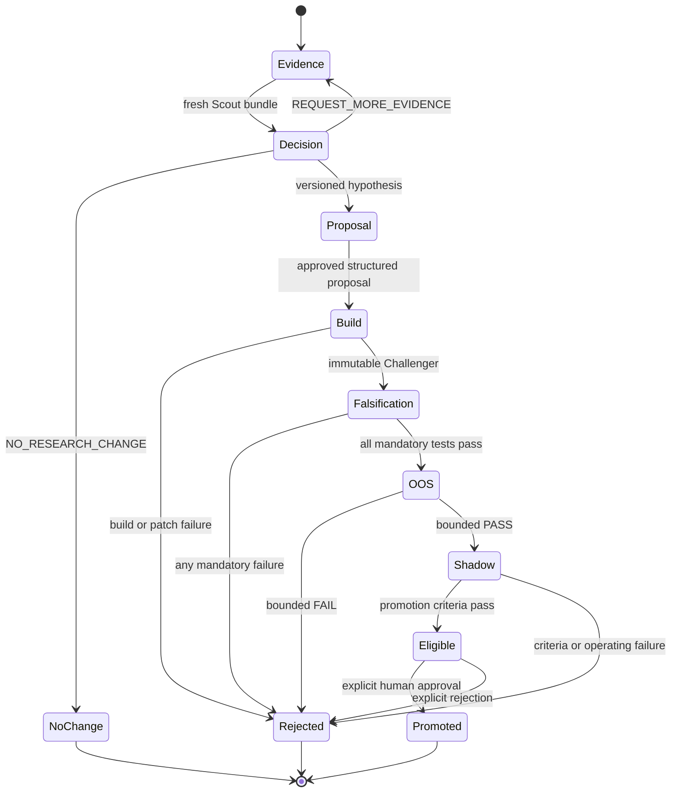

# Research Plane

## Purpose

The Research Plane turns current evidence and observed strategy failures into
auditable, versioned Challenger experiments. It is deliberately separate from
the Operational Trading Plane: research may be slow, unavailable, or rejected
without affecting NAV calculation, risk checks, paper execution, accounting, or
replay.

The loop is:



## Schedule

The default configuration separates operating cadence from research cadence:

- after the market session: aggregate daily performance and failure cases;
- weekly: run a deep research cycle;
- evidence-triggered: permit an additional cycle after enough new evidence is
  available.

All schedule values are versioned in
`config/research/research-plane.yaml`. Starting a research cycle never pauses the
Operational Trading Plane.

## Durable AI × Guard paper experiment

The operational AI and deterministic guard are measured in the independent
`ai_guard_factorial_v1` paper experiment:

| Arm | Deterministic guard | Operational AI |
| --- | --- | --- |
| `B0-VOL` | No | No |
| `B3-GUARD` | Yes | No |
| `B3-AI` | No | Yes |
| `B3-AI-GUARD` | Yes | Yes |

Each arm has separate cash, positions, pending orders, fills, ledger entries,
and NAV. The experiment persists immutable `INITIAL`, `PLANNED`, `FILL`, and
`DAILY_CLOSE` checkpoints through the existing append-only paper tables.
Replaying the checkpoint sequence reconstructs the same arm states and validates
the materialized orders, fills, ledger transactions, and ledger postings.

All four arms must share the versioned market manifest, forecast, decision
schedule, execution scenario, cost model, starting capital, policy input, and
configuration hash. A fill must name the common execution scenario. Missing,
duplicated, cross-arm, or mismatched records make the experiment status
`BLOCKED_MATCHED_CONDITIONS`; the system does not compute attribution from the
contaminated sample.

`GET /api/research/factorial/status` returns the configured daily aggregation
schedule, durable state for all four arms, replay hash, common-session count,
and readiness for the guard main effect, AI main effect, and AI × guard
interaction. The same object is included in `GET /api/research/status` and is
shown in the Research tab. Effect values remain preliminary until the configured
minimum matched-forward-session requirement is met. They are factorial
attribution, not a standalone claim of AI alpha.

This repository boundary records research paper events only. It has no endpoint
that creates live orders, and `real_order_routing=false` is validated on every
arm and reported by both status endpoints.

## Cycle inputs

Legacy cycles use `ResearchRequestV1`. Recursive cycles use
`ResearchRequestV2`; both contain only bounded, explicit inputs:

- Champion manifest and active Challenger manifests;
- strategy performance and failure-case summaries;
- regime, execution-cost, and capacity summaries;
- recent market evidence and Web Scout evidence;
- a versioned available-data catalog;
- allowed and forbidden change scopes;
- the experiment-family budget;
- request and cycle identifiers, timestamps, source commit, schema version, and
  context manifest hash.

Credentials, private account state, raw browser profiles, full private
repositories, previous conversations, hidden reasoning, and raw locked OOS
observations are prohibited.

## Web Scout

`WEB_SCOUT` uses a new ChatGPT conversation for every request. It actively
searches eligible sources and returns `ResearchEvidenceBundleV1`.

Source tiers are:

1. `TIER_1_OFFICIAL`
2. `TIER_2_PRIMARY_DATA`
3. `TIER_3_REPUTABLE_NEWS`
4. `TIER_4_INDUSTRY_ANALYSIS`
5. `TIER_5_SOCIAL`
6. `TIER_6_UNVERIFIED`

Every source records URL, title, publisher, publication and availability times,
capture time, tier, content hash, bounded excerpt, license note, related
instruments or factors, and corroboration/contradiction status. Social material
may establish a narrative or lead, but not a verified fact on its own.

See [WebGPT and AGBrowse research](webgpt-agbrowse-research.md).

## Commander selection

Exactly one Commander is selected for each request:

- `CODEX_SOL_MAX`
- `WEBGPT_SOL_PRO`

Selections are append-only and versioned. The host rejects:

- a decision from a different Commander;
- a response bound to another cycle, request, commit, Champion, experiment
  family, or context hash;
- a response received after expiry;
- a response created for a selection superseded after request creation.

Changing the selected Commander does not reinterpret an existing request. That
request becomes `STALE_SELECTION` and a new request must be created. The request
binds the append-only selection ID and version as well as the Commander kind;
switching away and then back to the same kind cannot revive it.

For `WEBGPT_SOL_PRO`, `research commander-run` executes the hash-bound request through
headed Chrome, local CDP, AGBrowse, and a fresh ChatGPT GPT-5.6 Sol Pro / xhigh
conversation. It has no API fallback. The selection is checked before transmission
and after completion, and the validated `ResearchDecisionV1` or
`ResearchDecisionV2` is atomically written to
the prepared cycle's `output/research_decision.json`. See
[WebGPT and AGBrowse research](webgpt-agbrowse-research.md).

## Commander decisions

`ResearchDecisionV1` and `ResearchDecisionV2` support:

- `NO_RESEARCH_CHANGE`
- `PROPOSE_NEW_STRATEGY`
- `PROPOSE_STRATEGY_REVISION`
- `PROPOSE_FEATURE_REVISION`
- `PROPOSE_CALIBRATION_REVISION`
- `RETIRE_STRATEGY`
- `REQUEST_MORE_EVIDENCE`

A legacy proposal decision must contain exactly one valid
`AlgorithmProposalV1`. A recursive proposal decision must contain exactly one
valid `AlgorithmProposalV2` bound to a funded action in the immutable
`ResearchActionPlanV1`.
`REQUEST_MORE_EVIDENCE` must name the missing evidence. Other decisions cannot
smuggle a proposal or evidence request through optional fields.

Model confidence is stored for audit but cannot drive promotion or capital.

## Candidate build

Commander and Builder are independent invocations. The Builder receives:

- the accepted structured proposal;
- a minimal immutable request-binding receipt;
- a clean source snapshot;
- output schemas and constraints;
- the public repository instructions.

It does not receive the full recursive request, research memory, action plan,
evidence bundle, Commander output, or any Scout/Commander conversation.
Candidate output is inspected before registration. A patch is rejected when it:

- changes the parent Champion in place;
- touches a forbidden or non-allowlisted path;
- contains unsafe absolute or parent-traversal paths;
- fails its patch hash or clean-worktree checks.

Protected infrastructure changes require a separate human-reviewed development
process.

## Challenger registry

Each accepted implementation creates `ChallengerManifestV1` with code, config,
patch, proposal, and test hashes. It begins at `PROPOSED` and progresses only
through append-only events.

Supported states:

```text
PROPOSED
BUILD_FAILED
TEST_FAILED
REPLAY_FAILED
OOS_REJECTED
SHADOW_PENDING
SHADOW_RUNNING
PROMOTION_ELIGIBLE
PROMOTED
REJECTED
RETIRED
```

The version must differ from its parent. A failure does not delete the manifest,
patch, tests, or result.

## Automated falsification

The mandatory suite covers:

- future, look-ahead, revised-data, constituent, and survivor leakage;
- parameter instability and neighborhood stability;
- date-shift, signal-inversion, and symbol-label placebos;
- single-symbol/month and top-five-trade dependence;
- 1×/2×/3× costs, delay, spread, liquidity, and capacity stress;
- market, sector, and known-factor neutralization;
- regime splits and partial-data removal;
- experiment-budget availability.

Missing mandatory results are a failure. Any mandatory `FAIL` or `BLOCKED`
prevents OOS and shadow admission.

### Forward-only evaluation input

The first live Challenger uses a separate prospective evidence path before
mandatory falsification. It seals one Candidate request at each parent
`Q1-DET` decision and later records the precommitted next-close outcome. After
126 successful sessions, `candidate_evaluation_dataset_v2` freezes the exact
first-N cohort and all terminal failures known at the selection cutoff.

Unlike the legacy single-manifest evaluation fixture, V2 preserves a distinct
request source manifest, calendar-path hash, transformation hash, and outcome
source hash for every scenario. Stateful parameter variants use only their own
prior target state. Future records cannot change the selected cohort or any
past scenario hash.

The host executes separate isolated primary and replay lanes, materializes the
evaluation trace, and runs the complete trusted falsification catalog. This is
still a pre-OOS service: it cannot inspect locked OOS observations, create a
shadow arm, promote a Challenger, mutate the Champion, or route an order.

## OOS and shadow

The OOS service consumes private observations but returns only a verdict, bounded
aggregate statistics, reason codes, common-session count, and budget usage.
Candidate processes never receive private dates, trades, daily returns,
positions, orders, or fills.

For V2, one immutable pre-OOS portfolio comparison contract fixes how the
Candidate sleeve is integrated into the complete Champion portfolio. The
private worker computes Candidate and Champion full-portfolio Sharpe separately,
uses paired stationary bootstrap indices, and returns only aggregate
DeltaSharpe bounds and 1x/2x/3x cost results.

Only an OOS `PASS` may become `SHADOW_PENDING`. Champion and Challenger shadow
arms must be independent but share the same execution contract. This produces a
matched comparison rather than a comparison contaminated by different prices,
costs, starting capital, or liquidity assumptions.

After explicit activation, only post-activation prospective evidence may feed
shadow performance. The trusted host binds each cycle to the actual Q1 parent
decision, deterministic Candidate primary/replay output, fresh persisted
quotes, and exact PIT ADV bars. Arbitrary target JSON and all legacy generic
cycles are classified as unattested and cannot enter promotion evidence.

The durable generic paper implementation, target binding, conservative fill
rules, and deterministic replay procedure are specified in
[`docs/research/shadow-paper-runtime.md`](research/shadow-paper-runtime.md).

## Recursive policy evaluation

The recursive research stack adds four disabled-by-default trusted layers:

1. an append-only experiment outcome ledger and point-in-time memory;
2. a deterministic Meta Controller that creates budgeted action plans;
3. whole-portfolio paired DeltaSharpe OOS/shadow gates and Promotion V2;
4. a four-arm chronological meta-OOS outer audit.

The outer audit compares a static Champion, fixed recalibration, a memoryless
Commander, and the adaptive Meta Controller. Each arm has private state and
uses the same predeclared market, execution, cost, and epoch conditions.
Protected returns stay inside the trusted environment; only aggregate metrics,
paired lower bounds, reason codes, and hashes cross the boundary. Meta-audit
records never become controller training data.

These components are research evaluators, not an autonomous deployment loop.
Automatic scheduling, automatic promotion, Champion mutation, and broker
routing remain unavailable.

## Promotion

Promotion eligibility checks all predeclared economic, risk, capacity, stability,
error-rate, and replay requirements. Passing creates
`ELIGIBLE_REQUIRES_MANUAL_APPROVAL`; it does not change the Champion.

V1 remains readable. New portfolio comparisons use
`TrustedPromotionEvaluationV2`, built from independently passing OOS V2 and
matched shadow V2 evidence plus actual falsification, replay, portfolio-binding,
and legacy risk/capacity gates. Automatic promotion is structurally rejected.
An explicit human approval records review without changing status. A separate
human Champion designation command must then supply the expected current
version; designation and the `PROMOTED` event commit atomically while all prior
designations remain append-only.

## Failure behavior

| Failure | Result |
| --- | --- |
| Scout/model/session mismatch | Discard result; cycle remains blocked |
| Commander timeout or binding mismatch | Discard decision; no candidate |
| Builder failure | Preserve `BUILD_FAILED` |
| Forbidden patch path | Reject patch; preserve audit event |
| Mandatory falsification failure | Preserve `TEST_FAILED` or `REPLAY_FAILED` |
| OOS failure | Preserve `OOS_REJECTED` |
| Research service unavailable | Operational paper system continues |
| Promotion criteria incomplete | `INELIGIBLE`; Champion unchanged |

No failure path falls back to a different model, reuses a conversation, edits
the Champion, or enables real routing.
